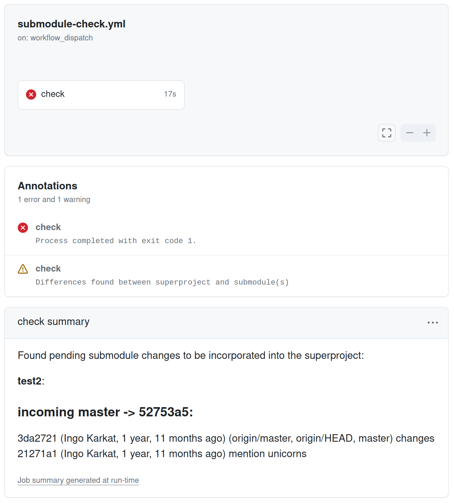

# git-supersubinout

This action checks for and logs commit discrepancies between the superproject reference and each submodule's default branch.

When a superproject is used to tie together multiple components that reside in separate repositories (but share the same development lifecycle), any changes that have been merged onto the submodule's master branch should also be referenced in the superproject's master branch.
Pending submodule changes prevent another developer from cleanly integrating their changes into the superproject.
Submodules may also be accidentally rolled back to previous versions in an unrelated superproject commit.

By running this action every night, you can catch such discrepancies early, and alert developers that submodule commits on master are waiting to be referenced in the superproject / that the superproject has accidentally reverted some submodule references.

The action determines whether there are incoming or outgoing commit discrepancies between the commit recorded in the superproject [in SUPER-COMMIT] for each submodule and that submodule's master branch [or SUB-BRANCH], and provides the result and logs in plain text and Markdown format.

# Usage

```yaml
- name: Checkout repo
  uses: actions/checkout@v4
  with:
    submodules: recursive # Need to fetch the submodules as well
    fetch-depth: 0  # Need the full history for the submodule comparison
- uses: inkarkat/git-supersubinout@master
  id: supersubinout
- name: Check summary # Provide a job summary with the differences (if any)
  if: fromJSON(steps.supersubinout.outputs.differences-found) # Interpret string output as boolean
  run: |
    cat >> "$GITHUB_STEP_SUMMARY" <<'EOF'
    ${{ steps.supersubinout.outputs.markdown-logs }}
    EOF
    exit 1 # If you want to fail the build (vs. just checking whether there are differences)
  shell: bash
```
# Example


